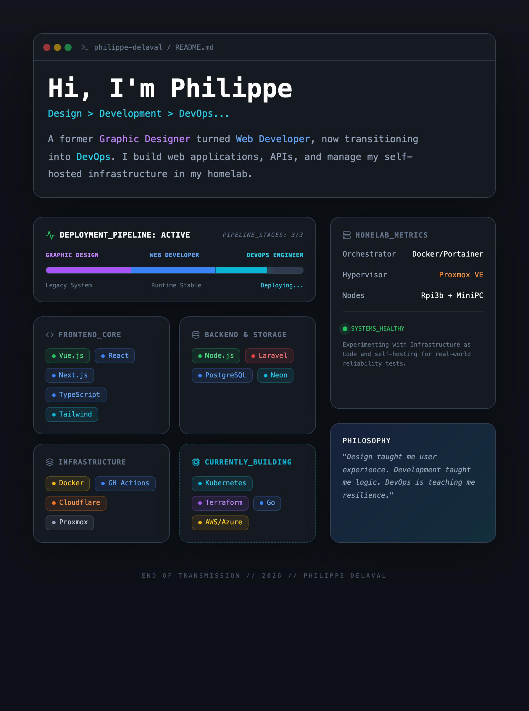

# Hi, I'm Philippe 👋



Web developer transitioning to **DevOps**.
Originally a graphic designer, I build web apps, APIs and tinker with
self-hosted infrastructure on my homelab.
Passionate about automation, CI/CD pipelines and cloud-native technologies.

---

## 🛠 Tech Stack

### Frontend
<p>
  
  
  
  
  
  
  
</p>

### Backend
<p>
  
  
  
  
  
</p>

### Database
<p>
  
  
  
</p>

### Hardware & Homelab
<p>
  
  
  
  
</p>

### DevOps & Cloud
<p>
  
  
  
  
</p>

### Methodology
<p>
  
  
</p>

### Learning
<p>
  
  
  
  
  
  
</p>

---

## 🎯 Goal
Becoming a **DevOps Engineer** — bridging my web development background
with cloud infrastructure, automation and self-hosted systems.
Currently building hands-on experience through my **homelab** and
real-world CI/CD pipelines.

---

## 🏠 Homelab
I run a self-hosted lab at home to experiment with:
- Container orchestration (Docker, and soon Kubernetes)
- Self-hosted services and monitoring
- Network configuration and infrastructure as code
- Raspberry Pi projects (automation, IoT with Arduino)

---

## 📌 Projects
- [portfolio](https://github.com/philippe-delaval/portfolio) — My developer portfolio

---

## 🔐 Project Maintenance

Useful local commands:

```bash
npm install
npm run build
npm run preview-generate
```

If your local Chromium setup refuses to launch with the browser sandbox enabled,
you can temporarily opt out for the screenshot command only:

```bash
PUPPETEER_DISABLE_SANDBOX=1 npm run preview-generate
```

The optional GitHub workflow can also regenerate the preview image automatically.
